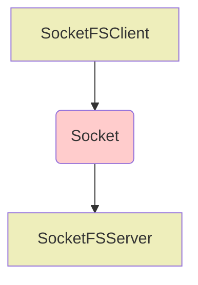

# socketfs

A pyfilesystem-socket spamwich.

    SocketFSClient
    --------------
       _Socket_
    ..............
    SocketFSServer
    

```mermaid
  graph TD
    client[SocketFSClient]:::pyfs
    socket( Socket ):::sock
    server[SocketFSServer]:::pyfs

    client --> socket --> server

    classDef pyfs fill:#eeb
    classDef sock fill:#fcc
```

