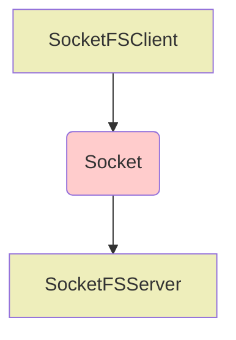

# socketfs

A pyfilesystem-socket spamwich.




#### Requirements
    
    fs>=2


## How to:

#### Use whatever pyfilesystem backing you like


```python
from fs.memoryfs import MemoryFS

testfs = MemoryFS()

# every world needs a population
testfs.makedir('/hello')

```

#### Wrap the filesystem in the server


```python
from socketfs import SocketFSServer

sockfs = SocketFSServer("demosock/demo.sock", testfs)
sockfs.forever()  # put this into the background,
                  # run in another terminal,
                  # or run in a container

```

#### Run the client in a separate process


```python
from socketfs import SocketFSClient

sockfs = SocketFSClient("demosock/demo.sock")
sockfs.listdir('/')

```


    ['hello']


### The Awesomeness Stops Here

I'm working on it.


```python

```
